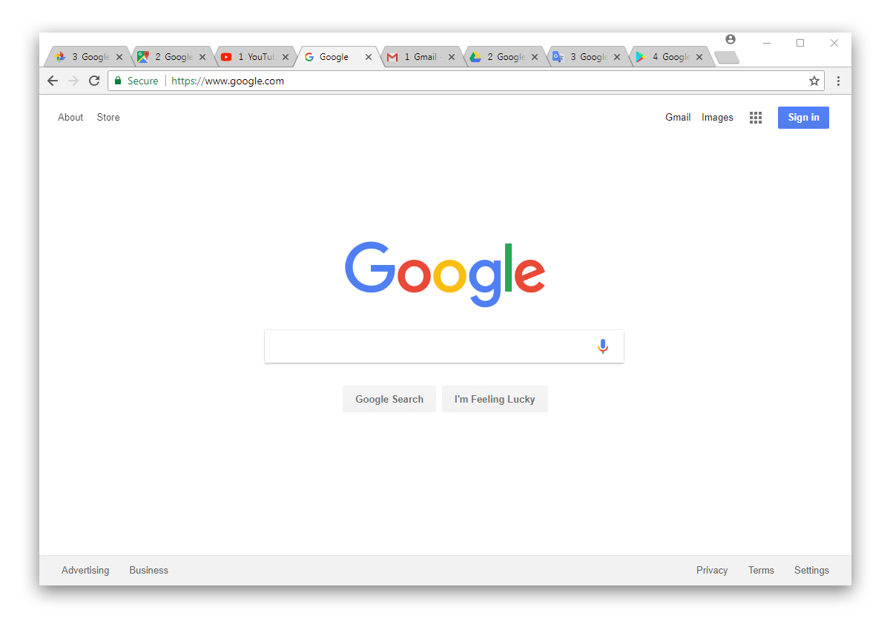

# Relative Tabs

Chrome extension for switching to a tab n-places from current tab. For example `Ctrl+3` will switch to the tab that is 3 tabs ahead (right) of your current tab. Similarly `Ctrl+Shift+2` will switch to the tab that is 2 tabs behind (left) of your current tab.

By default, Relative Tabs will modify tabs to include its relative position from the current active tab. This can be disabled in extension options `chrome://extensions/`.

Since Chrome extensions are limited to 4 keyboard shortcuts, the rest need to be manually set in keyboard shortcuts `chrome://extensions/shortcuts`. Recommended keyboard shortcuts below:

| Command Name | Shortcut |
| --- | --- |
| Next Tab 1 | `Ctrl+1` |
| Next Tab 2 | `Ctrl+2` |
| Next Tab \<num\> | `Ctrl+num` |
| |
| Previous Tab 1 | `Ctrl+Shift+1` | 
| Previous Tab 2 | `Ctrl+Shift+2` |
| Previous Tab \<num\> | `Ctrl+Shift+num` |

## Settings

- Toggle tab numbering (enabled by default)
- Set keyboard shortcuts
